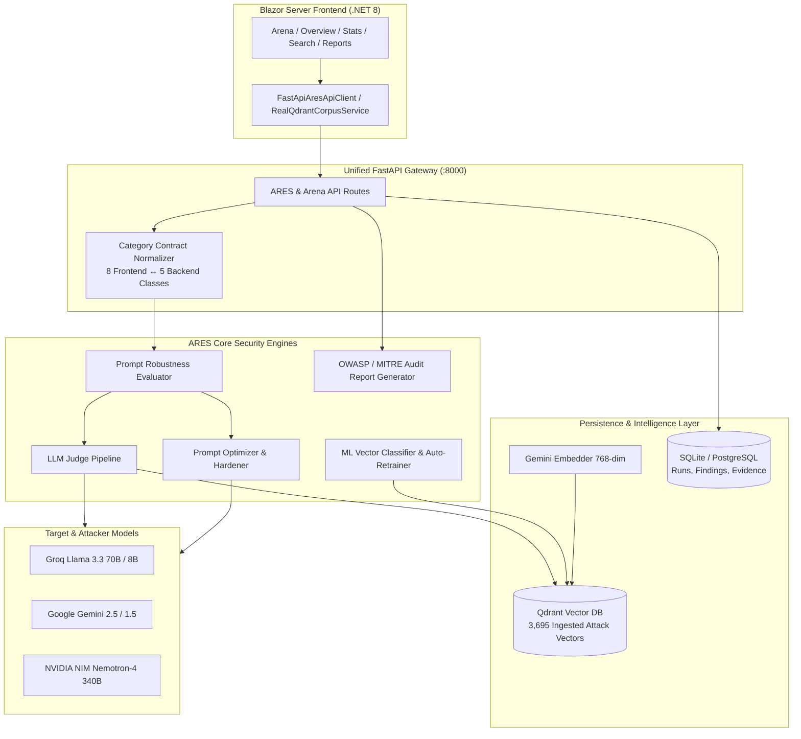

# ARES — AI Resilience and Evaluation Security System

[](https://www.python.org/)
[](https://dotnet.microsoft.com/)
[](https://fastapi.tiangolo.com/)
[](https://qdrant.tech/)
[]()

**ARES** is an enterprise-grade AI security platform for **Adaptive Red-Teaming, Prompt Hardening, and Runtime Enforcement**. It protects LLM applications against adversarial prompt injections, jailbreaks, role-play hijacks, context smuggling, delimiter confusion, and data exfiltration through live vector similarity analysis, multi-provider LLM judging, automated prompt hardening, and machine learning risk classification.

---

## 🏛️ System Architecture



---

## ✨ Key Capabilities

* **Live RAG Vector Retrieval**: Interrogates a local or remote **Qdrant** database populated with **3,695+ curated adversarial attack vectors** spanning 5 core exploit categories.
* **Continuous LLM Judge**: Evaluates model responses in real-time using Groq (Llama 3.3 70B) or Gemini, generating continuous risk scores (0–100%), severity ratings, and forensic explanations with fallback to rule-based heuristics.
* **Automated Prompt Hardening**: Identifies boundary weaknesses and applies heuristic and model-driven hardening strategies (zero-trust delimiters, canary token injection, system-instruction isolation) with fallback across NVIDIA, Gemini, and Groq.
* **ML Vector Classifier with Auto-Retraining**: Scikit-Learn linear classifier trained over Gemini vector embeddings achieving **100% cross-validation accuracy** across all attack categories, retrainable on demand via `POST /api/stats/retrain`.
* **Multi-Format Security Audit Reports**: Exports production-grade reports in **Markdown**, **styled HTML**, and structured **JSON** with explicit mappings to **OWASP Top 10 for LLM Applications (2025)** and **MITRE ATLAS**.
* **Unified Database Persistence**: Automatically records test runs, detections, and similarity evidence to SQLite or PostgreSQL via SQLAlchemy with automatic state recovery on restart.
* **Interactive Blazor UI**: Rich dashboards for live red-team sweeps, semantic vector search, ML analytics, real-time probe logs, and report exports.

---

## 📂 Project Structure

```
.
├── backend/
│   ├── app/                    # Platform database models, auth, and provider adapters
│   │   ├── database.py         # SQLAlchemy engine & session management
│   │   ├── models.py           # TestRun, Finding, Evidence, User, Project tables
│   │   ├── orchestrator.py     # Execution orchestrator with RAG similarity scoring
│   │   └── providers/          # Groq, Gemini, NVIDIA, and OpenAI provider adapters
│   ├── ares/                   # ARES Core Security Package
│   │   ├── api/                # FastAPI application & route controllers
│   │   │   ├── main.py         # App factory & CORS configuration
│   │   │   ├── schemas.py      # Pydantic v2 contract schemas
│   │   │   └── routes/         # tests, search, harden, stats, corpus, dashboard
│   │   ├── evaluation/         # Robustness evaluator, ML stats, and report generator
│   │   ├── optimizer/          # Prompt hardening strategies & LLM optimizer
│   │   ├── redteam/            # Attack payloads, mutators, and probe generators
│   │   ├── vectordb/           # Qdrant store client and Gemini embedding engine
│   │   └── mappings.py         # Canonical 8-to-5 category contract normalizer
│   ├── qdrant_data/            # Persistent local Qdrant vector storage
│   ├── tests/                  # 97 comprehensive backend unit and integration tests
│   └── requirements.txt        # Python dependencies
├── src/
│   └── Ares.Web/               # Blazor Server UI (.NET 8)
│       ├── Components/         # Razor components & layouts
│       ├── Pages/              # Overview, Arena, Stats, Search, Reports
│       └── Services/           # FastApiAresApiClient & RealQdrantCorpusService
├── tests/
│   └── Ares.Web.Tests/         # 14 xUnit & bUnit frontend tests
├── docs/                       # Architecture decisions and API documentation
└── Ares.sln                    # Visual Studio / .NET Solution
```

---

## 🚀 Getting Started

### Prerequisites

* **Python 3.12+**
* **.NET 8.0 SDK** ([Download](https://dotnet.microsoft.com/download/dotnet/8.0))
* **API Keys** (At least one):
  * `GROQ_API_KEY` (Recommended for fast attacker/victim evaluation)
  * `GEMINI_API_KEY` (Required for 768-dim embeddings & Gemini models)
  * `NVIDIA_API_KEY` (Optional for Nemotron evaluations)

---

### 1. Backend Setup (FastAPI & Qdrant)

1. Navigate to the `backend/` directory and activate your virtual environment:
   ```bash
   cd backend
   python -m venv venv
   # Windows:
   .\venv\Scripts\activate
   # Linux/macOS:
   source venv/bin/activate
   ```

2. Install dependencies:
   ```bash
   pip install -r requirements.txt
   ```

3. Configure your environment in `backend/.env`:
   ```env
   GROQ_API_KEY=your_groq_api_key
   GEMINI_API_KEY=your_gemini_api_key
   NVIDIA_API_KEY=your_nvidia_api_key
   DATABASE_URL=sqlite:///./test-orchestrator.db
   QDRANT_STORAGE_PATH=./qdrant_data
   ```

4. Start the unified backend server (port `8000`):
   ```bash
   python main.py
   ```
   * Interactive OpenAPI Docs: [http://localhost:8000/docs](http://localhost:8000/docs)
   * Health Check: [http://localhost:8000/healthz](http://localhost:8000/healthz)

---

### 2. Frontend Setup (Blazor Server)

1. From the repository root, restore and build the .NET solution:
   ```bash
   dotnet restore Ares.sln
   dotnet build Ares.sln
   ```

2. Run the Blazor application:
   ```bash
   dotnet run --project src/Ares.Web
   ```

3. Open your browser and navigate to the reported local URL (typically `http://localhost:5149` or `https://localhost:7149`).

---

## 🧪 Running Tests

### Backend Test Suite (Python)
Run all 97 backend unit tests, category mappings, and security evaluation suites:
```bash
cd backend
pytest -m "not integration" -v
```

### Frontend Test Suite (.NET)
Run all 14 Blazor frontend and corpus integration tests:
```bash
dotnet test Ares.sln
```

---

## 🛡️ Attack Category Normalization

ARES transparently normalizes between frontend/OpenAPI categories and core backend exploit vectors:

| Frontend / C# Category | Backend Exploit Class | MITRE ATLAS Technique | OWASP LLM Top 10 |
| :--- | :--- | :--- | :--- |
| `DirectPromptInjection` | `instruction_override` | AML.T0054 (LLM Jailbreak) | LLM01: Prompt Injection |
| `SystemPromptExtraction` | `instruction_override` | AML.T0054 (System Prompt Extraction) | LLM07: System Information Leak |
| `PolicyBypass` | `instruction_override` | AML.T0054 (Guardrail Circumvention) | LLM01: Prompt Injection |
| `RoleManipulation` | `role_play_hijack` | AML.T0054 (Persona Impersonation) | LLM01: Prompt Injection |
| `ToolMisuse` | `delimiter_confusion` | AML.T0051 (LLM Delimiter Hijacking) | LLM02: Sensitive Info Disclosure |
| `EncodingOrObfuscation` | `encoding_tricks` | AML.T0054 (Adversarial Encoding) | LLM01: Prompt Injection |
| `IndirectPromptInjection` | `context_smuggling` | AML.T0051 (Indirect Injection) | LLM01: Prompt Injection |
| `DataExfiltration` | `context_smuggling` | AML.T0052 (Data Extraction via Prompt) | LLM06: Sensitive Data Exposure |

---

## 📄 License & Attribution

Developed for high-assurance AI security evaluation and red-teaming. For architecture details, see the [`docs/`](docs/) directory.
