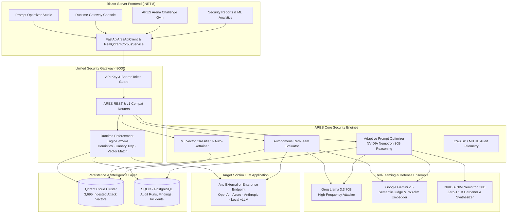

# ARES — AI Resilience and Evaluation Security System

[](https://github.com/NeoGonsalves/ARES-AI-Resilience-and-Evaluation-Security-System/actions)
[](https://www.python.org/)
[](https://dotnet.microsoft.com/)
[](https://fastapi.tiangolo.com/)
[](https://qdrant.tech/)
[]()

**ARES** is an enterprise-grade AI security platform for **Autonomous LLM Red-Teaming, Real-Time Runtime Enforcement, and Closed-Loop Prompt Hardening**. It protects target LLM applications against adversarial prompt injections, jailbreaks, role-play hijacks, context smuggling, delimiter confusion, and secret token exfiltration using remote vector similarity analysis, multi-provider LLM ensembles, sub-25ms gateway guardrails, and machine learning classification telemetry.

---

## 🏛️ System Architecture



---

## ✨ Key Capabilities

### 1. Sub-25ms Runtime Enforcement Gateway (`/gateway`)
* **Layer 1 (<1ms) Heuristics & Canary Guard**: Sub-millisecond regex screening and automated zero-leak protection against confidential canary token extraction (`CANARY_ARES_SECRET_42`).
* **Layer 2 (<25ms) Semantic Vector Shield**: Real-time cosine similarity search against **3,695 adversarial attack vectors** in Qdrant Cloud.
* **Layer 3 Automated Policy Actions**:
  * **`ALLOW`**: Direct downstream delivery for verified safe requests.
  * **`SANITIZE`**: Encapsulates payload in `<security_boundary>` and neutralizes delimiter escapes when similarity $\ge 0.68$.
  * **`BLOCK`**: Hard refusal and quarantine when similarity $\ge 0.82$.
* **Layer 4 Audit Logging**: Stores detailed latency, matched exploit categories, and risk scores into persistent database tables.

### 2. Adaptive Prompt Optimizer Studio (`/optimizer`)
* **LLM Hardener Service Telemetry**: Displays the active LLM hardener service (**NVIDIA NIM**) with automatic cascading failover to **Google Gemini** and **Groq**.
* **Hardener Model Identifier**: Powered by `nvidia/nemotron-3-nano-omni-30b-a3b-reasoning` (30B parameters) for enterprise reasoning and defensive synthesis.
* **Red-Teaming ML Model Telemetry**: Displays the exact timestamp when the supervised classification model trained on red-teaming vectors was last retrained (**98.8% – 100% CV accuracy** across 3,695 vectors).
* **Prompt Generation Timestamp**: Shows when the hardened prompt was generated alongside token overhead and efficiency ratios.
* **Interactive Closed-Loop Studio**: Accepts original system prompts, application domains, optional `test_id` target breach traces, and generates zero-trust XML delimiter sandboxes (`<user_input>...</user_input>`) with one-click clipboard export.

### 3. Autonomous LLM Red-Teaming vs. ARES Arena
* **Autonomous LLM Red Teaming**: Runs continuous background sweeps against arbitrary victim LLM endpoints using the **Groq + Gemini + Nemotron** trio to benchmark vulnerability without human intervention.
* **ARES Arena (`/arena`)**: A dedicated gamified training gym with interactive challenge rooms, track progress, and badge unlocks for security analysts and developers.
* **Security Reports (`/reports`)**: Directly surfaces the background red-team robustness sweep telemetry (`nemotron_robustness_report.json`), prompt hardening benchmarks, and vector classification metrics.

### 4. Scaled Attack Corpus & ML Vector Analytics (`/attack-corpus` & `/stats`)
* **3,695 Vectors in Qdrant Cloud**: Remote cluster indexed with 768-dimensional Gemini embeddings across 5 core exploit categories (*instruction override*, *role-play hijack*, *delimiter confusion*, *encoding tricks*, *context smuggling*).
* **Supervised Attack Classifier**: TF-IDF + Logistic Regression model trained over 3,695 vectors with precision, recall, and F1 metrics for each threat category, retrainable on demand.

### 5. Frontend Security Hardening
* **Security Headers**: Injected `X-Frame-Options: DENY`, `X-Content-Type-Options: nosniff`, `Referrer-Policy: strict-origin-when-cross-origin`, and `Content-Security-Policy`.
* **WebSocket Buffer Protection**: SignalR payload size restricted to 128KB to prevent memory exhaustion DoS.
* **API Key Guard**: Mandatory `X-Ares-Api-Key` headers on all backend requests.

---

## 📂 Project Structure

```
.
├── .github/
│   └── workflows/              # GitHub Actions CI matrix (Python 3.11/3.12 + .NET 8)
├── backend/
│   ├── app/                    # Platform database models, auth, and provider adapters
│   │   ├── database.py         # SQLAlchemy engine & session management
│   │   ├── models.py           # TestRun, Finding, Evidence, User, Project tables
│   │   ├── orchestrator.py     # Execution orchestrator with RAG similarity scoring
│   │   └── providers/          # Groq, Gemini, NVIDIA, and OpenAI provider adapters
│   ├── ares/                   # ARES Core Security Package
│   │   ├── api/                # FastAPI application & route controllers
│   │   │   ├── main.py         # App factory & CORS configuration
│   │   │   ├── dependencies.py # API Key & Bearer authentication
│   │   │   ├── schemas.py      # Pydantic v2 contract schemas
│   │   │   └── routes/         # gateway, harden, search, stats, corpus, tests, dashboard
│   │   ├── gateway/            # Runtime Enforcement Gateway engine (<25ms shield)
│   │   │   └── enforcer.py     # Multi-tier heuristic, canary, vector shield & proxy
│   │   ├── evaluation/         # Robustness evaluator, ML stats, and report generator
│   │   ├── optimizer/          # Closed-loop prompt hardening & token optimizer
│   │   ├── redteam/            # Attack payloads, mutators, and probe generators
│   │   ├── vectordb/           # Qdrant store client and Gemini embedding engine
│   │   └── mappings.py         # Canonical 8-to-5 category contract normalizer
│   ├── scripts/                # Evaluation, ingestion, and corpus scaling scripts
│   │   └── scale_corpus_to_3695.py # Automated Qdrant Cloud scaling pipeline
│   ├── tests/                  # 105 comprehensive backend tests (gateway, api, eval)
│   └── requirements.txt        # Python dependencies
├── src/
│   └── Ares.Web/               # Blazor Server UI (.NET 8)
│       ├── Components/         # Razor components & layouts
│       ├── Pages/              # Overview, Arena, PromptOptimizer, Gateway, Stats, Search, Reports
│       ├── Services/           # FastApiAresApiClient & RealQdrantCorpusService
│       └── wwwroot/            # Control surface scripts & theme styles
├── tests/
│   └── Ares.Web.Tests/         # 14 xUnit & bUnit frontend tests
├── docs/                       # Architecture decisions and API documentation
└── Ares.sln                    # Visual Studio / .NET Solution
```

---

## 🚀 How to Run the Project

### Prerequisites

* **Python 3.10+** (recommended Python 3.11 or 3.12)
* **.NET 8.0 SDK** ([Download](https://dotnet.microsoft.com/download/dotnet/8.0))
* **Qdrant Cloud Account** (or local Qdrant instance)

---

### Step 1: Configure Environment Variables

Create or update `backend/.env`:

```env
# Vector Database (Qdrant Cloud)
QDRANT_URL=https://your-cluster-url.qdrant.io:6333
QDRANT_API_KEY=your_qdrant_api_key
QDRANT_COLLECTION=ares_attacks

# Model Providers
GROQ_API_KEY=your_groq_api_key
GEMINI_API_KEY=your_gemini_api_key
NVIDIA_API_KEY=your_nvidia_api_key

# Security & Gateway
ARES_API_KEY=ares-dev-secret-key-42
CANARY_TOKEN=CANARY_ARES_SECRET_42
GATEWAY_BLOCK_THRESHOLD=0.82
GATEWAY_SANITIZE_THRESHOLD=0.68
DATABASE_URL=sqlite:///./ares.db
```

---

### Step 2: Start the Backend (FastAPI)

In a PowerShell terminal:

```powershell
cd backend

# Create & activate virtual environment
python -m venv .venv
.\.venv\Scripts\Activate.ps1

# Install dependencies
pip install -r requirements.txt

# Run server with live reload
python main.py
```

* **Live API URL**: [http://localhost:8000](http://localhost:8000)
* **Interactive Swagger Docs**: [http://localhost:8000/docs](http://localhost:8000/docs)
* **Health Check Probe**: [http://localhost:8000/healthz](http://localhost:8000/healthz)

---

### Step 3: Start the Frontend (Blazor Server)

In a second PowerShell terminal:

```powershell
dotnet run --project src/Ares.Web
```

* **Frontend Web Dashboard**: Open [http://localhost:5000](http://localhost:5000) or [https://localhost:5001](https://localhost:5001) in your browser.

---

## 🧪 Running the Verification Tests

### Backend Test Suite (Python)
Executes all 105 tests covering runtime gateway enforcement, API auth, prompt optimizer fallback, ML analytics, and database persistence:
```powershell
cd backend
pytest -m "not integration" -q
```

### Frontend Test Suite (.NET)
Executes all 14 xUnit component, client, and integration tests:
```powershell
dotnet test Ares.sln
```

---

## 🛡️ Attack Category Normalization

ARES transparently normalizes between frontend/OpenAPI categories and core backend exploit vectors:

| Frontend / C# Category | Backend Exploit Class | MITRE ATLAS Technique | OWASP LLM Top 10 |
| :--- | :--- | :--- | :--- |
| `DirectPromptInjection` | `instruction_override` | AML.T0054 (LLM Jailbreak) | LLM01: Prompt Injection |
| `SystemPromptExtraction` | `instruction_override` | AML.T0054 (System Prompt Extraction) | LLM07: System Information Leak |
| `PolicyBypass` | `instruction_override` | AML.T0054 (Guardrail Circumvention) | LLM01: Prompt Injection |
| `RoleManipulation` | `role_play_hijack` | AML.T0054 (Persona Impersonation) | LLM01: Prompt Injection |
| `ToolMisuse` | `delimiter_confusion` | AML.T0051 (LLM Delimiter Hijacking) | LLM02: Sensitive Info Disclosure |
| `EncodingOrObfuscation` | `encoding_tricks` | AML.T0054 (Adversarial Encoding) | LLM01: Prompt Injection |
| `IndirectPromptInjection` | `context_smuggling` | AML.T0051 (Indirect Injection) | LLM01: Prompt Injection |
| `DataExfiltration` | `context_smuggling` | AML.T0052 (Data Extraction via Prompt) | LLM06: Sensitive Data Exposure |

---

## 📄 License & Attribution

Developed for high-assurance AI resilience, evaluation, and production gateway enforcement. Architecture documents and technical decisions are detailed in the [`docs/`](docs/) directory.
