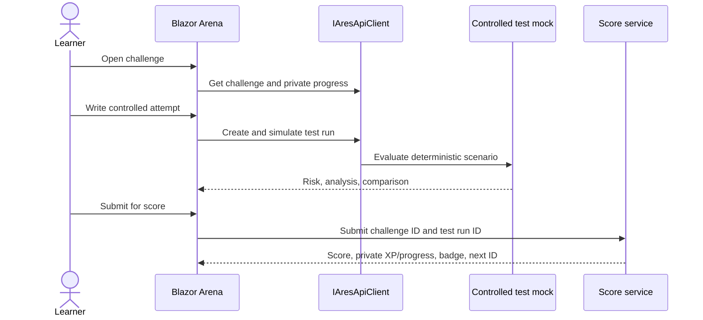

# ARES Arena challenge system

## Product boundary

ARES Arena is a private learning and practice layer over the ARES controlled-test workflow. It is not a live attack platform: every exercise uses deterministic mock data, controlled categories, and no external AI-provider calls.

## Tracks

| Track | Learner goal | Mock evaluation focus |
|---|---|---|
| Attacker | Understand adversarial patterns in a safe exercise. | Attack success, risk/severity, prompt efficiency, and execution speed. |
| Defender | Write resilient prompt boundaries. | Attack resistance, hardening improvement, and prompt clarity. |

Challenges use the stable `AttackCategory` and `DifficultyTier` enums. Each has a title, objective, scenario context, optional guidance, category, time par, maximum score, tags, and an optional room association.

## Challenge lifecycle

The explicit submit step avoids awarding progression for a cancelled or failed attempt. Score history and XP remain scoped to the current user profile.

## Individual progression

- XP equals the submitted mock score, with 500 XP per level.
- The profile records total XP, current level, solved challenge counts by track, badges, private best score, and last attempt time.
- The first successful submitted exercise may award `First Blood`.
- No leaderboard, peer discovery, team ranking, or public score API is in scope.
- Future authentication must derive the profile ID from the server-side identity token; the mock uses `USR-001` only for prototype data.

## Optional rooms and paths

Rooms are curated, themed groups of challenges. Learning paths list rooms, but neither a room nor a path is required to access the main catalogue. Room completion can earn a badge in a later backend phase. Prerequisites are shown as recommended preparation; locked advanced exercises retain their own challenge-level status.

## Scoring

| Track | Components | Max |
|---|---|---:|
| Attacker | Attack success, severity achieved, prompt efficiency, speed bonus | 100 |
| Defender | Attack resistance, hardening improvement, prompt clarity | 100 |

The mock scoring implementation is `MockData.ComputeScore`. It uses the completed `TestRun` analysis and token/duration estimates. It is intentionally transparent and deterministic, not a production benchmark or safety judgment.

## Safety and privacy rules

- All examples, evidence, and output are rendered as text, not executable markup.
- Provider credentials never enter browser code or Arena models.
- The default audit log is redacted; raw prompts require future privileged, audited retention controls.
- Failed provider simulations do not retain model output.
- The API contract uses correlation IDs to connect a challenge action with redacted diagnostics.
