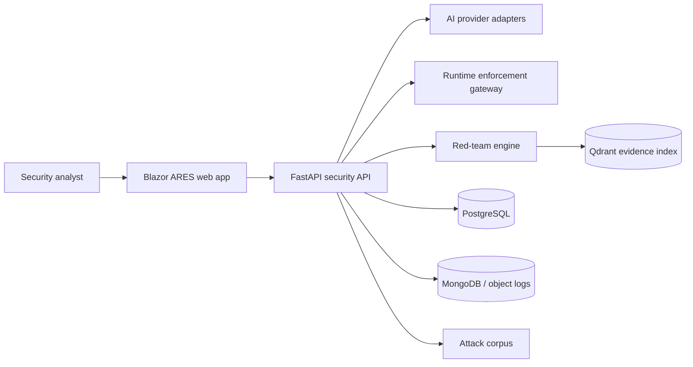
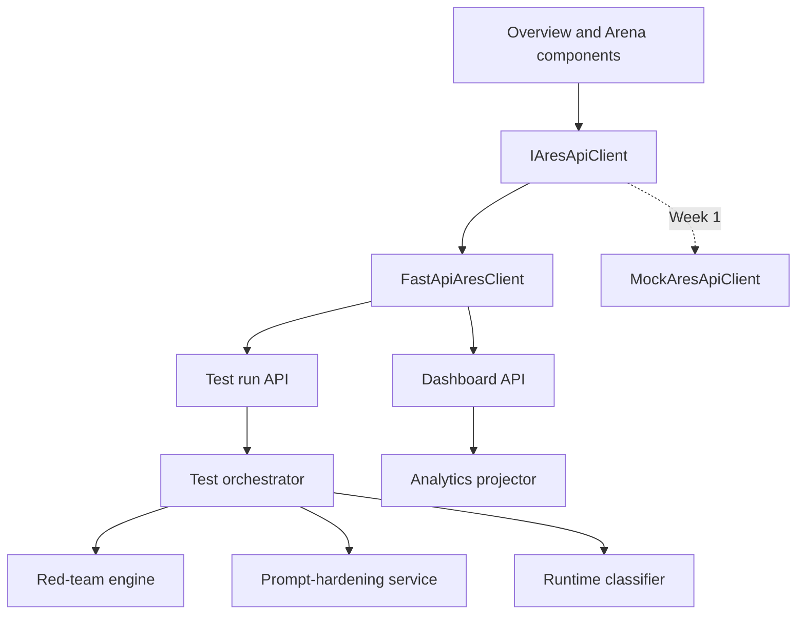
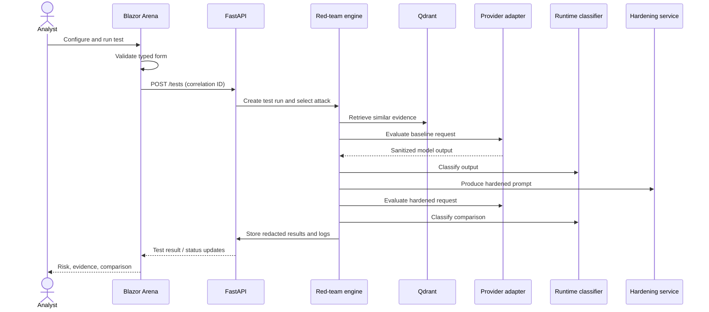
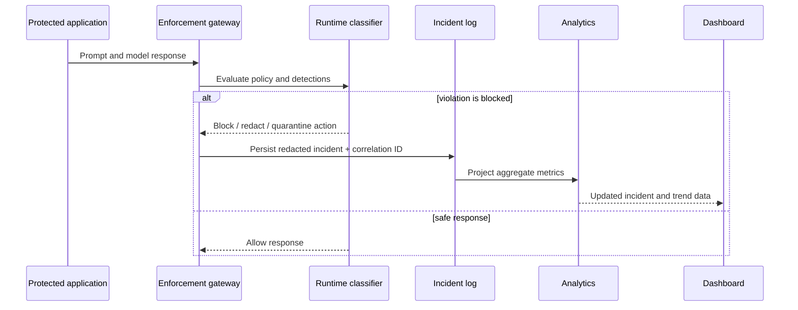
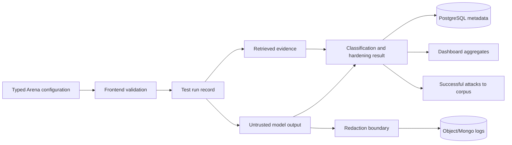
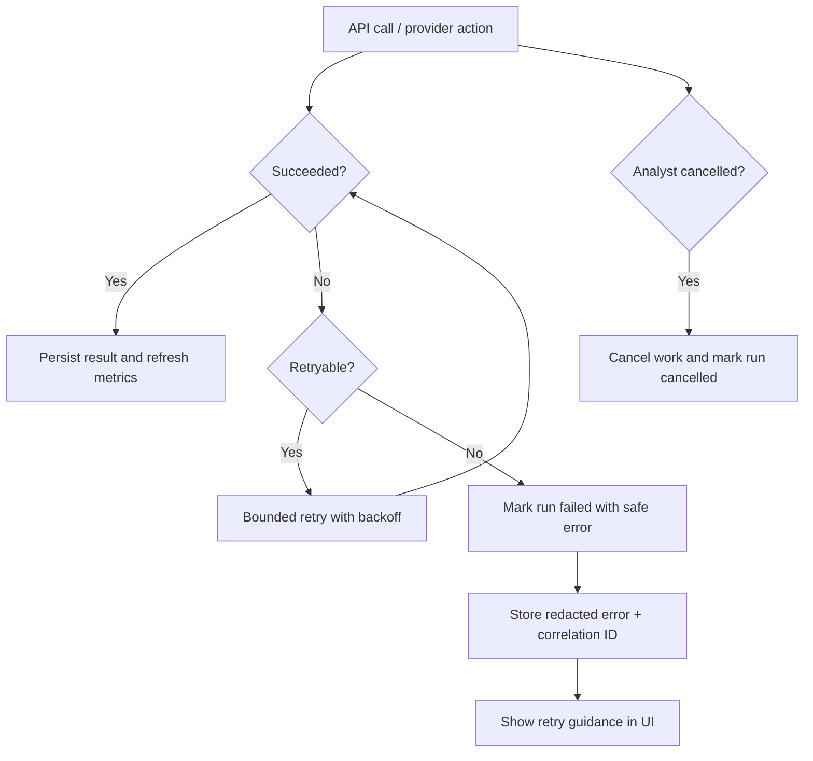
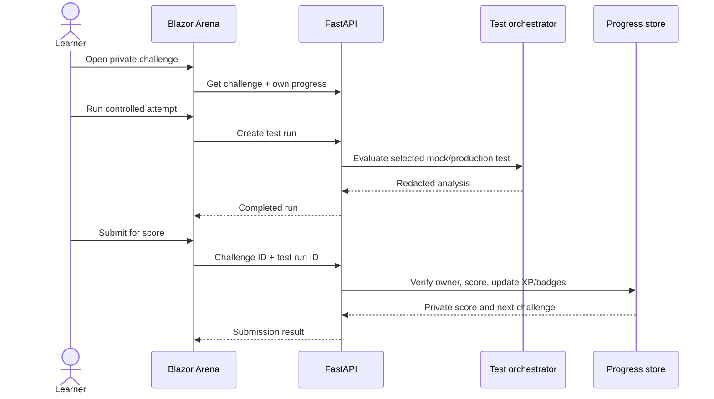

# ARES integration flow

This prototype calls `IAresApiClient`. `MockAresApiClient` is registered in `Program.cs`; replace that registration with an authenticated `FastApiAresClient` once the API exists. Page components must not call `HttpClient` or provider SDKs directly.

## System context

## Component architecture

## Arena test sequence

## Runtime incident sequence

## Data flow and retention

Raw prompts and model output should be redacted or tokenized before durable logging. PostgreSQL holds workflow metadata and queryable summaries; object/Mongo storage holds access-controlled redacted diagnostic material; Qdrant stores vetted evidence embeddings, not frontend credentials.

## Failure handling

The UI never renders error bodies as HTML. It uses the user-safe message and correlation ID from the standard API error. A provider timeout becomes a failed test with no retained model output; a partial dashboard response retains available panels and shows a partial-data notice.

## Replacing mock services

1. Implement `FastApiAresClient : IAresApiClient` using `IHttpClientFactory`, `System.Net.Http.Json`, and the same JSON names in `Models/AresModels.cs`.
2. Register a named HTTP client with the API base URL from server-side configuration; do not expose provider keys to WebAssembly/browser code.
3. Send an `X-Correlation-ID` for every request and pass cancellation tokens to `SendAsync`.
4. Map non-success responses into `ApiError`; only retry endpoints marked retryable.
5. Keep the page and reusable components unchanged; remove the mock registration only after endpoint contract tests pass.

## Arena private progression flow

The profile scope is always the authenticated user. Optional rooms are metadata that organize challenges; they do not grant access to another user's records or impose participation in a learning path.
